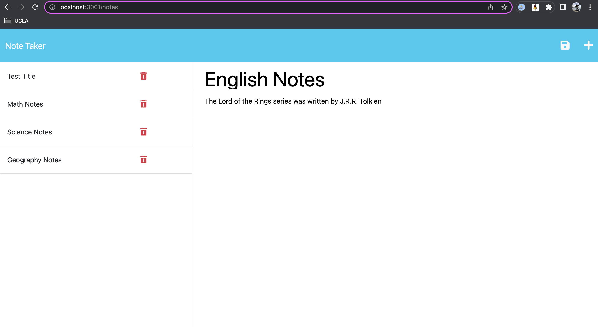

#  Challenge Eleven - Note Taking App

  
        
  ## Description
   This week's assignment was to add back-end functionality to pre-existing front-end starter code, so that users can add, save, and retrieve notes and reminders. It's a simple application that makes it easy for users to keep track of notes of important information that is easily accessible. This project was done entirely with javascript, and used the express, path, fs, and short-unique-id modules.
  
  ## Table of Contents
  - [Link](#link)
  - [Usage](#usage)
  - [License](#license)

   ## Link
  You can access the application at https://carli-hudson-note-taker.herokuapp.com/  
  
  ## Usage
  This application could be used by anyone with access to a device that has internet, and can be used for any projects for school, work, or at home. When the user clicks the link, they'll be taken to a homepage with a button to get started. 
  
  
  
  Once on the notes page, The user will see a panel on the left where their notes will be stored, and on the right is the space to enter their note title and body. Once the user begins typing in the body, a floppy disk "save" icon will appear. When the note is complete, press the save icon and your note will appear in the left panel. 
  
  
  
  If you would like to access it later, click on it in the left panel and it will reappear in the right panel. To add a new note, press the plus sign icon in the top right corner.  

  
  
  ## License
      This project is covered under the ISC license. To learn more, click the badge at the top.

  ## Questions
  If you have any questions, reach out to me at https://github.com/carlihudson, or shoot me an email at carlihudson@gmail.com.
   